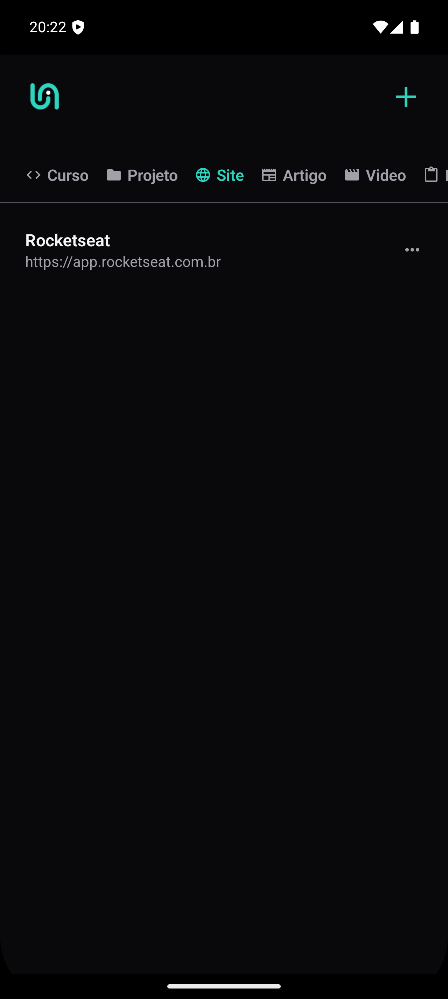

# App-links

Um aplicativo simples para salvar, organizar e gerenciar links de maneira eficiente. Ideal para guardar referências, artigos, vídeos e outros recursos importantes.




---

## Funcionalidades

- **Salvar links**: Adicione novos links facilmente.
- **Organizar links**: Categorize os links por temas.
---

## Tecnologias Utilizadas

- **Framework**: [React Native](https://reactnative.dev/)
- **Armazenamento**: [Async Storage](https://react-native-async-storage.github.io/async-storage/)
- **Estilização**: CSS-in-JS ou bibliotecas de estilização para React Native (como Styled Components ou outras).

---

## Como Rodar o Projeto

### Pré-requisitos

- [Node.js](https://nodejs.org/) instalado.
- [Git](https://git-scm.com/) instalado.
- Conta no GitHub (opcional para clonar o repositório).
- Expo CLI

## Instalação e Execução

Siga os passos abaixo para configurar o projeto:

1. Clone este repositório:
   ```bash
   git clone https://github.com/seu-usuario/App-links
2. Navegue até o diretório do projeto:
   ```bash
   cd App-links
3. Inicie o servidor de desenvolvimento:
   ```bash
   mpx expo start
4. Escaneie o QR code no terminal ou na página web gerada para executar o aplicativo no seu dispositivo ou em um emulador.

---

## Contato

Criado por [Gabriel Prado](https://github.com/Gabriel-Prd). Entre em contato se tiver dúvidas ou sugestões!
